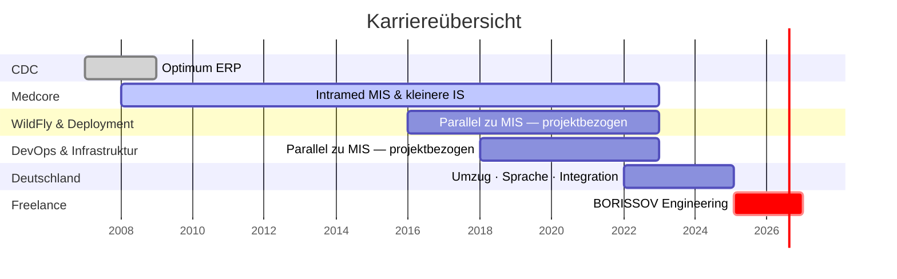

# Karriere-Zeitstrahl

Entwicklung der Verantwortung — von Enterprise-Software über MIS bis zu projektbezogener Infrastruktur.

---

## 2007 – 2008 · [CDC](https://cdc.ru/) · Optimum ERP

Erste Rolle: **Einführung des Optimum-ERP-Systems**.

- Geschäftsanforderungen, Konfiguration, Rollout
- Grundlage für Systemdenken in Enterprise-Umgebungen

→ [Optimum-Projekt](../03-projects/01-optimum/)

---

## 2008 – 2022 · Medcore · Medizinische Informationssysteme

**Wechsel zu Medcore (2008):** Einführung und Betrieb von **MIS Intramed** (InterSystems Caché) und **weiteren, kleineren Informationssystemen**.

- 14+ Jahre — durchgehender MIS-Betrieb bis zum Umzug nach Deutschland; ab ~2016 **WildFly & Infrastruktur**, ab ~2018 **DevOps & CI/CD** im Parallelbetrieb (siehe unten)
- Krankenhaus mit **40.000 Patienten pro Jahr**
- Integration: Labor, Histopathologie, Dokumentenerkennung
- Einführungen an **weiteren großen Kliniken in Russland**

→ [Medizinisches Informationssystem](../03-projects/02-medical-information-system/)

---

## ab ~2016 · Infrastruktur — parallel zum MIS-Betrieb

**Gleichzeitig** zum laufenden Intramed-Support: seit ca. **2016 WildFly**, Deployment und Application Server; ab ca. **2018** zusätzlich DevOps, CI/CD und Linux — **je nach Projekt**:

| Jahr | Projekt | Schwerpunkt |
|------|---------|-------------|
| ~2016 | [Dokumentenerkennung](../03-projects/05-document-recognition/) | Deployment, OCR, MIS-Integration |
| ~2018 | [Histopathologie-LIS](../03-projects/04-histopathology/) | Test, Deployment, MIS-Sync |
| ~2020 | [Referenzdaten-Plattform](../03-projects/03-reference-data-platform/) | air-gapped Deployment, Cluster-Betrieb |

Infrastruktur- und DevOps-Kenntnisse wuchsen **schrittweise und projektweise** — nicht über eine dedizierte DevOps-Stelle. Letzte Projekte parallel zum MIS-Betrieb bis **2022**.

---

## 2022 – 2025 · Deutschland · Umzug und Integration

Nach dem Ausstieg aus dem operativen MIS-Betrieb bei Medcore: **Umzug von Russland nach Köln**, **Deutsch lernen** und **berufliche Integration** in Deutschland — Vorbereitung auf die Selbstständigkeit.

- Spracherwerb und Anpassung an den deutschen Arbeitsmarkt
- Vorbereitung der Selbstständigkeit (Recherche, Positionierung, technische Weiterentwicklung)

---

## ab Feb 2025 · Freelance · [BORISSOV Engineering](https://borissov-it.de/)

Gewerbeanmeldung **Februar 2025**. Infrastruktur, Kubernetes und Automatisierung werden **bewusst und explizit** zum Kerngeschäft.

| Jahr | Projekt | Rolle |
|------|---------|-------|
| 2025 | [KI-Lernplattform](../03-projects/06-ai-learning-platform/) | DevOps — K8s, GitLab CI, Keycloak |
| 2025 | [BI-Plattform](../03-projects/07-bi-platform/) | Metabase, Monitoring, Backups |
| 2025 | [Investment-Plattform](../03-projects/08-investment-platform/) | Full Stack — Next.js, n8n, Docker |
| 2025 | [Microservice-Plattform](../03-projects/09-microservice-platform/) | DevOps *(laufend)* |

---

## Visuelle Übersicht

