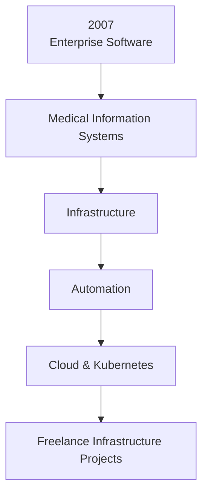

# Career Timeline

Not a list of job titles — an evolution of responsibility across the full IT system lifecycle.

---

## 2007 · Enterprise Software

Where it started: implementing and configuring enterprise business systems — understanding how organizations actually run on software.

- Business requirements analysis and solution design
- Enterprise application implementation and customization
- Working directly with users, analysts, and project stakeholders
- Foundation for everything that followed: systems thinking, not just tooling

---

## Medical Information Systems

Deep specialization in clinical and hospital environments — long-running, mission-critical platforms where downtime has real consequences.

- Medical Information System development and maintenance (InterSystems Caché)
- 20+ year partnership supporting a clinic treating 40,000 patients per year
- Adapting platforms to evolving clinical and regulatory requirements
- Full clinical workflow coverage — from implementation to production support

→ [Medical Information System project](../03-projects/02-medical-information-system/)

---

## Infrastructure

From application delivery to owning the environments systems run in — servers, networks, availability, security.

- Linux administration and production hardening
- Application servers (WildFly), databases (PostgreSQL, MS SQL Server)
- Reverse proxies, TLS, high availability
- Designing environments that development teams and business can depend on

---

## Automation

Reducing manual work, repeatability, and risk — pipelines and workflows instead of one-off operations.

- CI/CD: GitHub Actions, GitLab CI, Jenkins
- Infrastructure as Code: Terraform, Helm
- Process automation: n8n, scripted operations
- GitOps-minded deployments with clear promotion paths

---

## Cloud & Kubernetes

Modern platform engineering — containers, orchestration, observability, self-hosted alternatives to US cloud dependency.

- Kubernetes cluster design and day-2 operations
- Docker, Helm, monitoring (Prometheus, Grafana)
- Cloud and VPS providers: AWS, DigitalOcean, Hetzner
- Self-hosted platforms: Metabase, Keycloak, Nextcloud, n8n

→ [Microservice Platform](../03-projects/09-microservice-platform/) · [BI Platform](../03-projects/07-bi-platform/)

---

## Freelance Infrastructure Projects · Present

[borissov-it.de](https://borissov-it.de/) — independent engineering for German mid-sized businesses.

- Internal platforms, document processing, and knowledge workflows on own infrastructure
- GDPR-compliant, self-hosted systems with full handover to client teams
- Fixed scope, fixed price — analysis, design, development, deployment
- Selected work: marketplace BI, investment automation, medical systems, custom business applications

→ [Website](https://borissov-it.de/) · [Projects](../03-projects/)

---

## Visual Overview

