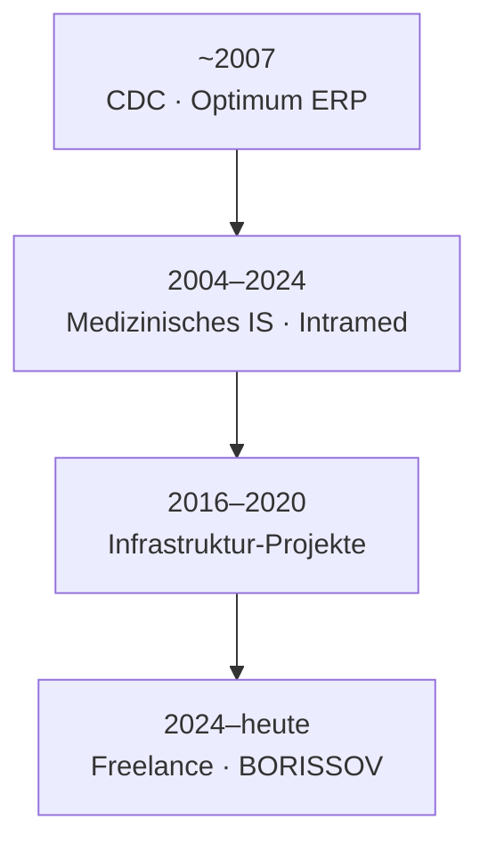

# Karriere-Zeitstrahl

Entwicklung der Verantwortung — von Enterprise-Software bis zur vollen Systemhoheit.

---

## ~2007 · Enterprise-Software · [CDC](https://cdc.ru/)

Erste Rolle: **Einführungsspezialist für das Optimum-ERP-System**.

- Geschäftsanforderungen, Konfiguration, Rollout
- Verständnis, wie Organisationen von integrierter Enterprise-Software abhängen
- Grundlage für Systemdenken, das die gesamte Karriere prägte

→ [Optimum-Projekt](../03-projects/01-optimum/)

---

## 2004–2024 · Medizinische Informationssysteme

Kern der Karriere: **Einführung, Anpassung und langfristiger Support von Intramed** (InterSystems Caché).

- 20+ Jahre Partnerschaft mit einem Krankenhaus mit **40.000 Patienten pro Jahr**
- Vollständige klinische Workflows — keine einmalige Lieferung
- Integrierte Systeme: Labor, Histopathologie, Dokumentenerkennung
- Einführungen an **weiteren großen Kliniken in Russland**

Das prägende Erlebnis: Verantwortung für ein mission-kritisches System über Jahrzehnte — nicht jährlicher Projektwechsel.

→ [Medizinisches Informationssystem](../03-projects/02-medical-information-system/)

---

## 2016–2020 · Infrastruktur- & Integrationsprojekte

Parallel zur MIS-Arbeit — Infrastrukturverantwortung wuchs, als die Organisation größere technische Projekte übernahm:

| Jahr | Projekt | Schwerpunkt |
|------|---------|-------------|
| ~2016 | [Dokumentenerkennung](../03-projects/05-document-recognition/) | Deployment, OCR-Pipeline, MIS-Integration |
| ~2018 | [Histopathologie-LIS](../03-projects/04-histopathology/) | Test, Deployment, bidirektionale MIS-Sync |
| ~2020 | [Referenzdaten-Plattform](../03-projects/03-reference-data-platform/) | WildFly-Cluster, air-gapped Netzwerk, HA-Backend |

DevOps-Fähigkeiten entstanden hier — nicht aus einem Jobtitel, sondern aus dem, was die Systeme erforderten.

---

## 2024–heute · Freelance · [BORISSOV Engineering](https://borissov-it.de/)

Unabhängiges Engineering für europäische Unternehmen. Infrastruktur und Automatisierung als explizite Leistungen.

| Jahr | Projekt | Rolle |
|------|---------|-------|
| 2025 | [KI-Lernplattform](../03-projects/06-ai-learning-platform/) | DevOps — K8s, GitLab CI, DevSecOps, Keycloak |
| 2025 | [BI-Plattform](../03-projects/07-bi-platform/) | Metabase, Monitoring, Backups, SSL |
| 2025 | [Investment-Plattform](../03-projects/08-investment-platform/) | Volle Verantwortung — Entwicklung + Deployment |
| 2025 | [Microservice-Plattform](../03-projects/09-microservice-platform/) | DevOps — CI/CD, DevSecOps *(laufend)* |

---

## Visuelle Übersicht

