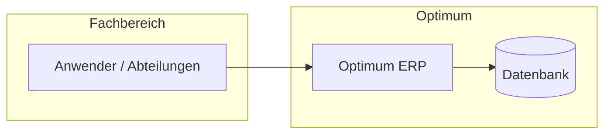

# Optimum ERP — Einführung

## Projekt

Einführung des **Optimum**-ERP-Systems bei [CDC](https://cdc.ru/) — erste berufliche Rolle.

| | |
|---|---|
| **Zeitraum** | 2007 – 2008 |
| **Arbeitgeber** | CDC |
| **Rolle** | Einführungsspezialist |
| **Status** | Abgeschlossen |

## Rolle

**Spezialist für Enterprise-Software-Einführung**

Verantwortlich für die Analyse von Geschäftsanforderungen, Konfiguration des Optimum-Systems und Begleitung des Rollouts für Anwender.

## Aufgaben

- Geschäftsprozessanalyse und Anforderungserhebung
- Konfiguration und Anpassung des Optimum-Systems
- Anwenderschulung und Support nach der Einführung
- Abstimmung zwischen Fachbereichen und technischer Umsetzung

## Architektur

Enterprise-Monolith-Modell — integrierte Module für organisatorische Workflows.

## Technologien

`Optimum ERP` `MS SQL Server` `Windows Server` `Enterprise Integration`

## Herausforderungen

1. **Brücke zwischen Fachsprache und Systemkonfiguration** — operative Bedürfnisse in ERP-Parameter übersetzen
2. **Anwenderakzeptanz** — sicherstellen, dass Mitarbeiter nach dem Go-live effektiv arbeiten können
3. **Erste Produktionsverantwortung** — lernen, dass Einführung nicht mit dem Deployment endet

## Lessons Learned

- Enterprise-Software betrifft **Organisationen**, nicht nur Technologie
- Qualität der Einführung entscheidet, ob ein System genutzt oder aufgegeben wird
- Diese Rolle legte den Grundstein für eine langjährige Laufbahn im Systemdenken

## Verwandt

- [Erfahrung — CDC](../../02-career/experience.md)
- [Karriere-Zeitstrahl](../../02-career/timeline.md)
