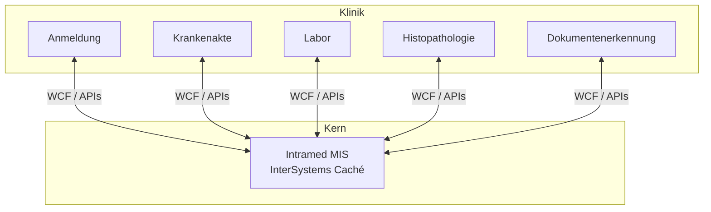

# Medizinisches Informationssystem (Intramed)

## Projekt

**20+ Jahre Wartungs- und Entwicklungspartnerschaft** für ein Krankenhaus-Medizininformationssystem auf Basis von **InterSystems Caché** (Intramed-Plattform) — kontinuierlich angepasst an neue klinische Anforderungen einer Klinik mit **40.000 Patienten pro Jahr**.

Zusätzlich Einführung und Betrieb von Intramed an **weiteren großen Kliniken in Russland**. Integration von Labor-, Histopathologie- und Dokumentenerkennungs-Subsystemen.

| | |
|---|---|
| **Zeitraum** | 2004 – 2024 |
| **Rolle** | Einführung, Anpassung, langfristiger Support |
| **Patienten** | 40.000 / Jahr |
| **Status** | Langfristige Produktionspartnerschaft |

## Rolle

**Spezialist für Medizinische Informationssysteme**

Keine kurze Einführung — fortlaufende Verantwortung für eine mission-kritische klinische Plattform: Upgrades, Integrationen, Produktionssupport und Workflow-Anpassung.

## Aufgaben

- Intramed-Einführung, Konfiguration und Anpassung
- Vollständige klinische Workflows und regulatorische Anpassung
- Integration mit Labor-, Histopathologie- und Dokumentensystemen
- Produktionssupport, Störungsbehebung und Systemweiterentwicklung
- Einführungen an weiteren großen Kliniken in Russland

## Architektur

## Technologien

`InterSystems Caché` `Intramed` `WCF` `MS SQL Server` `Windows Server` `Klinische Integrationen`

## Herausforderungen

1. **20 Jahre Systemevolution** — kontinuierliche Anpassung ohne Störung des Klinikbetriebs
2. **Multi-System-Integration** — Labor, Pathologie und Scanning müssen mit dem MIS synchron bleiben
3. **Produktion mit hohem Einsatz** — Ausfallzeit wirkt sich direkt auf die Patientenversorgung aus

## Lessons Learned

- Langfristige Systemverantwortung schafft Tiefe, die kurze Projektzyklen nicht können
- Klinische Umgebungen verlangen Zuverlässigkeit vor Neuheit
- Integration ist oft schwieriger als das Kernsystem selbst
- Vertrauen über Jahrzehnte bedeutet: mit Ärzten und Verwaltung sprechen, nicht nur mit Ingenieuren

## Verwandt

- [Histopathologie-LIS](../04-histopathology/) — bidirektionale MIS-Integration
- [Dokumentenerkennung](../05-document-recognition/) — OCR-Pipeline-Integration
- [Case Study auf borissov-it.de](https://borissov-it.de/work)

## Fotos

Siehe [photos/](photos/) für Screenshots, sofern vorhanden.
