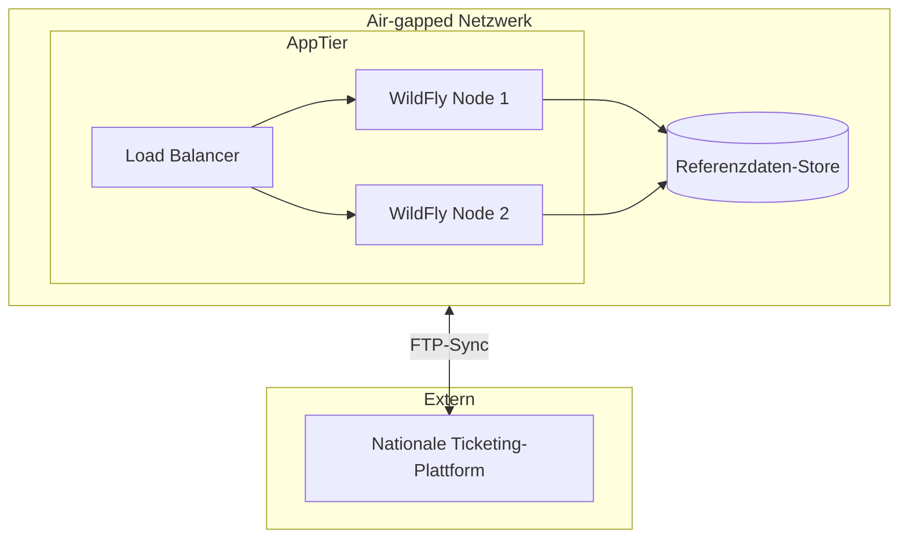

# Referenzdaten-Plattform

## Projekt

Hochverfügbare **Referenzdaten-Management-Plattform** für einen **nationalen Verkehrsbetreiber** — deployed in einem **air-gapped Netzwerk** an einem staatlichen Eisenbahnforschungsinstitut. Backend auf einem **WildFly-Cluster** mit Integration zur nationalen Bahn-Ticketing-Plattform.

| | |
|---|---|
| **Zeitraum** | ~2020 |
| **Rolle** | Infrastruktur — Cluster-Setup, Deployment, Betrieb |
| **Umgebung** | Air-gapped Netzwerk |
| **Status** | Produktion |

## Rolle

**Infrastruktur-Ingenieur**

Konfiguration des WildFly Application Server Clusters und Deployment des Referenzdatensystems in einer abgeschotteten, offline-fähigen Umgebung.

## Aufgaben

- WildFly-Cluster-Design, Setup und Hardening
- Anwendungsdeployment auf HA-Backend-Infrastruktur
- Air-gapped Deployment-Prozeduren
- Integrationssupport mit nationaler Bahn-Ticketing-Plattform (FTP-basiert)
- Produktionsmonitoring und operative Stabilität

## Architektur

## Technologien

`WildFly` `Java EE` `PostgreSQL` `Patroni HA` `Docker Compose` `FTP-Integration` `Prometheus` `Grafana`

## Herausforderungen

1. **Air-gapped-Einschränkungen** — kein öffentliches Internet; Offline-Deployment und Update-Prozeduren
2. **Hochverfügbarkeit in isolierter Umgebung** — Cluster-Failover ohne Cloud-Managed-Services
3. **Integration auf nationaler Ebene** — zuverlässige Synchronisation mit externen Ticketing-Systemen

## Lessons Learned

- Air-gapped Produktion lehrt Selbstständigkeit — jede Abhängigkeit muss geplant sein
- HA auf WildFly erfordert operative Disziplin, nicht nur Konfiguration
- Referenzdaten-Plattformen sind Integrations-Hubs — Infrastruktur und Datenfluss sind gleichermaßen kritisch

## Verwandt

- [Case Study auf borissov-it.de](https://borissov-it.de/work)
- [Architektur — air-gapped Muster](../../04-architecture/)

## Fotos

Siehe [photos/](photos/) für Diagramme und Screenshots.
