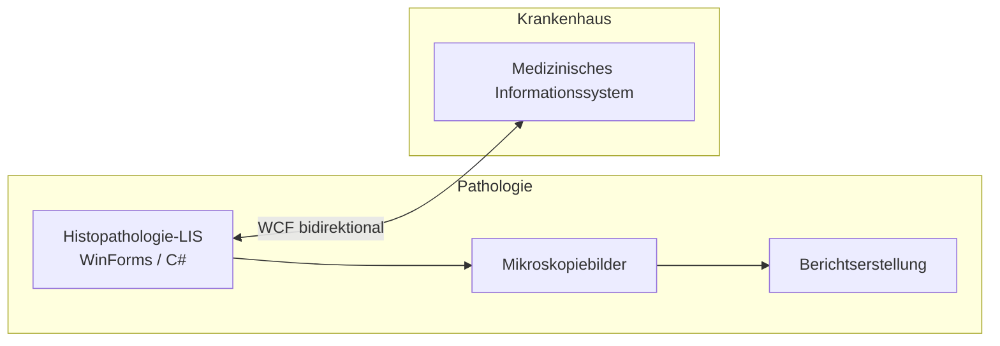

# Histopathologie-Laborsystem

## Projekt

Individuelles **Histopathologie-Laborinformationssystem** mit **bidirektionaler Integration** zum Krankenhaus-MIS — Verwaltung von Biopsie- und Autopsie-Workflows, Berichtsdruck mit Mikroskopiebildern und Patientendatenaustausch.

| | |
|---|---|
| **Zeitraum** | ~2018 |
| **Rolle** | Test, Deployment, Produktionssupport |
| **Integration** | Bidirektionale MIS-Sync via WCF |
| **Status** | Produktion |

## Rolle

**Deployment- & Support-Ingenieur**

Verantwortlich für Test, Deployment und Support des Laborsystems in Produktion — zuverlässiger bidirektionaler Datenaustausch mit dem Kern-MIS.

## Aufgaben

- Systemtests vor und nach dem Deployment
- Produktionsdeployment und Umgebungskonfiguration
- Support der bidirektionalen MIS-Integration (WCF-Services)
- Laufender Produktionssupport und Störungsbehebung
- Abstimmung mit dem Pathologie-Fachpersonal

## Architektur

## Technologien

`C#` `WinForms` `WCF` `MS SQL Server` `MIS-Integration` `Windows Server`

## Herausforderungen

1. **Zuverlässigkeit der bidirektionalen Sync** — Patientendaten müssen zwischen LIS und MIS konsistent sein
2. **Bildlastige Berichte** — Mikroskopiebilder in klinischen Druck-Workflows
3. **Spezialisierte klinische Domäne** — Pathologie-Workflows unterscheiden sich von allgemeiner Krankenhaus-IT

## Lessons Learned

- Laborsysteme sind Integrationsprobleme genauso wie Anwendungsprobleme
- WCF-Integrationen betreiben noch immer Krankenhäuser — Legacy respektieren, Schnittstellen dokumentieren
- Tests in klinischen Umgebungen erfordern Geduld und enge Zusammenarbeit mit dem medizinischen Personal

## Verwandt

- [Medizinisches Informationssystem](../02-medical-information-system/)
- [Case Study auf borissov-it.de](https://borissov-it.de/work)

## Fotos

Siehe [photos/](photos/) für Screenshots, sofern vorhanden.
