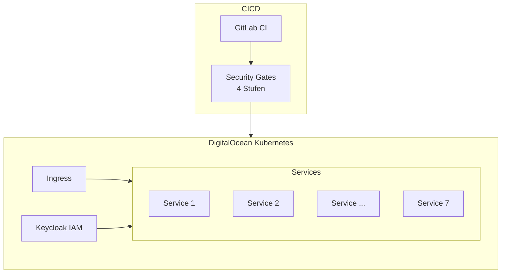
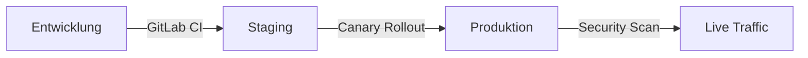

# KI-Lernplattform

## Projekt

**Kubernetes-Plattform für ein KI-gestütztes universitäres Lernsystem** — 7 Microservices, Identity Management, GitLab CI mit Security Gates und inkrementeller Produktions-Rollout auf DigitalOcean.

Freelance-Auftrag: volle DevOps-Verantwortung für Deployment und Betrieb.

| | |
|---|---|
| **Zeitraum** | 2025 |
| **Rolle** | Freelance DevOps Engineer |
| **Services** | 7 Microservices |
| **Status** | Produktion |

## Rolle

**DevOps Engineer (Freelance)**

End-to-end-Verantwortung für Kubernetes-Infrastruktur, CI/CD-Pipeline, DevSecOps-Gates und Identity Management.

## Aufgaben

- Kubernetes-Cluster-Design und Betrieb auf DigitalOcean
- Deployment von 7 Microservices mit inkrementeller (Canary) Rollout-Strategie
- GitLab CI-Pipeline mit 4-stufiger Security Pipeline
- Keycloak IAM Setup und Integration
- DevSecOps: automatisierte Security Gates im Deployment-Flow
- Produktionsmonitoring und operative Übergabe

## Architektur

## Deployment

## Technologien

`Kubernetes` `DigitalOcean` `Docker` `GitLab CI` `DevSecOps` `Keycloak` `Helm` `Nginx Ingress`

## Herausforderungen

1. **Koordination von 7 Services** — Abhängigkeitsreihenfolge und Rollout-Strategie
2. **Security Pipeline Integration** — Gates ohne Blockierung der Delivery-Geschwindigkeit
3. **Keycloak in Microservice-Landschaft** — zentrale Identity über alle Services

## Lessons Learned

- Canary Rollout auf K8s reduziert Risiko für Multi-Service-Bildungsplattformen
- DevSecOps-Gates funktionieren am besten, wenn sie früh integriert werden — nicht am Ende angeflanscht
- Freelance DevOps bedeutet: alles dokumentieren — das Kundenteam muss nach der Übergabe selbst betreiben können

## Verwandt

- [Case Study auf borissov-it.de](https://borissov-it.de/work)
- [Architektur — Kubernetes](../../04-architecture/kubernetes/)

## Fotos

Siehe [photos/](photos/) für Cluster- und Pipeline-Screenshots.
