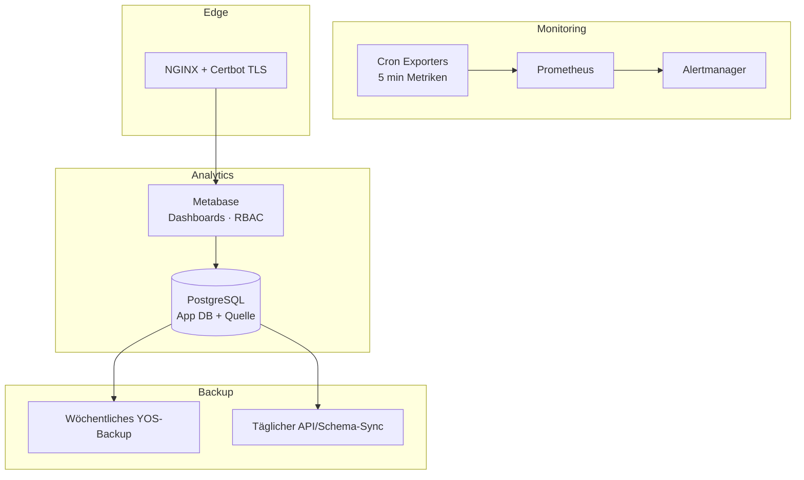

# Self-hosted BI-Plattform

## Projekt

**Self-hosted Metabase Analytics-Umgebung** für einen großen Online-Marktplatz — Produktions-Dashboards, Prometheus-Monitoring mit 5-Minuten-Metrik-Auflösung, automatisierte wöchentliche Backups und Zero-Touch SSL via Certbot.

Freelance-Auftrag: Deployment, Analytics, Scripting und vollständiger operativer Stack.

| | |
|---|---|
| **Zeitraum** | 2025 |
| **Rolle** | Freelance — Infrastruktur, BI, Betrieb |
| **Kunde** | Online-Marktplatz (Kleinanzeigen) |
| **Status** | Produktion |

## Rolle

**Infrastructure & Analytics Engineer (Freelance)**

Breiter Scope über reines DevOps hinaus: Metabase-Deployment, Dashboard-Erstellung, Monitoring, Alerting, Backups und SSL-Automatisierung.

## Aufgaben

- Self-hosted Metabase-Deployment (Datensouveränität, keine US-Cloud-Abhängigkeit)
- Dashboard-Design und -Umsetzung für Marktplatz-Analytics
- Eigene Skripte für Datenpipelines und operative Aufgaben
- Prometheus-Monitoring mit Alertmanager und 5-Minuten-Metrik-Auflösung
- Automatisierte wöchentliche Backups und täglicher API/Schema-Sync
- Certbot-Cron für Zero-Touch TLS-Zertifikatserneuerung
- 3 unabhängige Docker Compose Stacks mit separaten Lifecycles

## Architektur

## Deployment

Drei unabhängige Compose-Stacks — Analytics, Monitoring, Backup — jeweils mit eigenem Lifecycle und Update-Pfad.

## Technologien

`Metabase` `PostgreSQL` `Docker Compose` `Prometheus` `Alertmanager` `NGINX` `Certbot` `Bash/Python-Skripte`

## Herausforderungen

1. **Self-hosted vs. Cloud BI** — Kunde verlangte Datensouveränität; volle operative Verantwortung auf unserer Seite
2. **Drei-Stack-Architektur** — unabhängige Lifecycles ohne operatives Chaos
3. **Zero-Touch SSL** — Certbot-Automatisierung, die Server-Neustarts und Erneuerungen übersteht

## Lessons Learned

- Self-hosted Metabase ist für den Mittelstand tragfähig, wenn Monitoring und Backups von Tag eins dabei sind
- Trennung von Analytics-, Monitoring- und Backup-Stacks vereinfacht Updates
- Dashboard-Arbeit + Infrastruktur in einem Auftrag = schnellerer Business Value

## Verwandt

- [Case Study auf borissov-it.de](https://borissov-it.de/work)
- [Architektur — Docker](../../04-architecture/docker/)

## Fotos

Siehe [photos/](photos/) für Metabase-Dashboards und Grafana/Prometheus-Screenshots.
