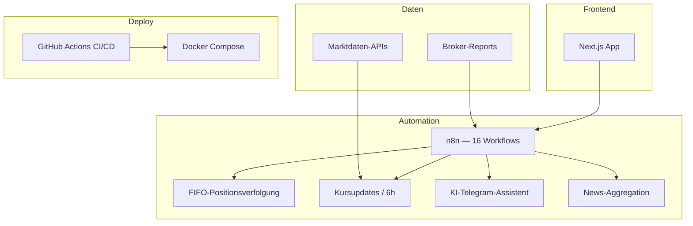

# Investment-Portfolio-System

## Projekt

**Vollständig eigenes Projekt** — automatisiertes Investment-Portfolio-System auf Basis von **n8n** mit **Next.js**-Frontend. 16 verknüpfte Workflows für den gesamten Investment-Zyklus: Broker-Report-Einlesung, FIFO-Positionsverfolgung, Live-Kursupdates, Renditeberechnungen, KI-Telegram-Assistent und Multi-Source-News-Aggregation.

| | |
|---|---|
| **Zeitraum** | 2025 |
| **Rolle** | Volle Verantwortung — Entwicklung, Deployment, Betrieb |
| **Workflows** | 16 n8n-Workflows |
| **Status** | Produktion (Eigenprojekt) |

## Rolle

**Solo Engineer — Full Stack**

Alles von der Anwendungsentwicklung bis Deployment und CI/CD — kein reiner DevOps-Auftrag.

## Aufgaben

- Next.js-Anwendungsentwicklung (Portfolio-UI, Datenvisualisierung)
- Design und Umsetzung von 16 n8n-Workflows
- Broker-Report-Parsing und FIFO-Positionsbuchhaltung
- Live-Kursupdates (alle 6 Stunden) und Renditeberechnungen
- KI-Telegram-Assistent-Integration
- Multi-Source-News-Aggregation
- Docker Compose Deployment
- GitHub Actions CI/CD-Pipeline

## Architektur

## Technologien

`Next.js` `React` `n8n` `Docker Compose` `GitHub Actions` `Telegram API` `Python/Bash-Skripte`

## Herausforderungen

1. **16 Workflow-Abhängigkeiten** — Orchestrierungskomplexität in n8n
2. **FIFO-Buchhaltungsgenauigkeit** — Finanzdaten müssen korrekt sein, nicht ungefähr
3. **Solo Full Stack** — kein Team für Frontend, Backend und Ops

## Lessons Learned

- n8n ist mächtig für Investment-Automatisierung, wenn Workflows dokumentiert und modular sind
- FIFO-Tracking gehört in explizite Workflow-Logik, nicht in Ad-hoc-Spreadsheet-Exports
- Den gesamten Stack zu besitzen (Next.js → n8n → Docker → CI) gibt Geschwindigkeit, erfordert aber Disziplin
- Eigenprojekte beweisen Fähigkeiten besser als Behauptungen im Lebenslauf

## Verwandt

- [Case Study auf borissov-it.de](https://borissov-it.de/work)
- [GitHub](https://github.com/boralekc)

## Fotos

Siehe [photos/](photos/) für UI- und Workflow-Screenshots.
