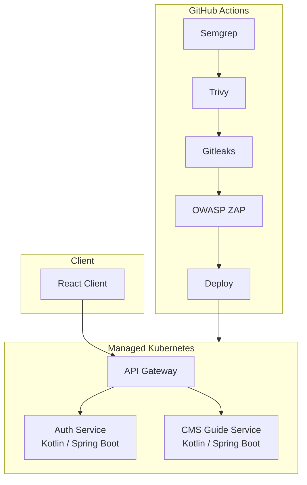

# Microservice-Plattform (Hexagonale Architektur)

## Projekt

**Multi-Service-Backend** nach Clean / Hexagonal Architecture — Authentication Service, CMS Guide Service, API Gateway und React Client. Deployment auf Managed Kubernetes via GitHub Actions mit **5-stufiger Security Pipeline** (Semgrep, Trivy, Gitleaks, OWASP ZAP).

Freelance DevOps-Rolle: Deployment, CI/CD und DevSecOps. **Projekt in Arbeit.**

| | |
|---|---|
| **Zeitraum** | 2025 |
| **Rolle** | Freelance DevOps Engineer |
| **Services** | 4 Repositories (Kotlin/Spring Boot + React) |
| **Status** | In Arbeit |

## Rolle

**DevOps Engineer (Freelance)**

Deployment-Infrastruktur, CI/CD-Pipelines und Security Scanning — Zusammenarbeit mit dem Entwicklungsteam an einer noch unfertigen Plattform.

## Aufgaben

- Managed Kubernetes Deployment-Konfiguration
- GitHub Actions CI/CD für 4 Service-Repositories
- Integration der 5-stufigen Security Pipeline
- DevSecOps-Tools: Semgrep, Trivy, Gitleaks, OWASP ZAP
- Environment Promotion und Deployment-Automatisierung
- Infrastruktur-Dokumentation für die Übergabe

## Architektur

## Technologien

`Kubernetes` `Kotlin` `Spring Boot` `React` `GitHub Actions` `Semgrep` `Trivy` `Gitleaks` `OWASP ZAP` `Docker`

## Herausforderungen

1. **5-stufige Security Pipeline** — Balance zwischen Gründlichkeit und Pipeline-Geschwindigkeit
2. **Multi-Repo-Koordination** — 4 Services mit unabhängigen Release-Zyklen
3. **Laufendes Projekt** — Infrastruktur muss sich mit unfertiger Anwendungsarchitektur weiterentwickeln

## Lessons Learned

- Security-Scanning-Schichten sind nur wertvoll, wenn Fehler actionable sind — nicht noisy
- Hexagonale Architektur in Microservices beeinflusst Deployment-Grenzen — Service-Verträge respektieren
- DevOps bei einem laufenden Projekt erfordert Flexibilität ohne Kompromisse bei Produktionsstandards

## Verwandt

- [Case Study auf borissov-it.de](https://borissov-it.de/work)
- [Architektur — GitOps](../../04-architecture/gitops/)

## Fotos

Siehe [photos/](photos/), sobald Deployment-Screenshots verfügbar sind.
