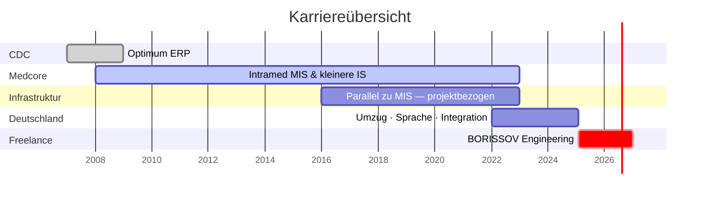

# Alex Borissov

**Deutsch** · [English](en/README.md)

**Infrastructure & Automation Engineer** · Köln, Deutschland

**Ich implementiere, integriere und automatisiere geschäftskritische IT-Systeme** — von Enterprise-Software und medizinischen Informationssystemen bis hin zu modernen Kubernetes-Plattformen und Self-hosted-Infrastrukturen.

Ich bringe komplexe Systeme zuverlässig in den produktiven Betrieb — und begleite sie von der Implementierung bis zum stabilen Langzeitbetrieb. Über 18 Jahre Erfahrung. Köln. Selbstständig unter [borissov-it.de](https://borissov-it.de/).

Dieses Repository dokumentiert **wer ich bin und wie ich arbeite** — keine Bewerbung auf eine bestimmte Stelle.

[Wer ich bin](01-about/) · [Website](https://borissov-it.de/) · [LinkedIn](https://www.linkedin.com/in/boralekc) · [GitHub](https://github.com/boralekc) · [Kurzprofil](resume/resume.md) · [E-Mail](mailto:alxboriss@gmail.com)

---

## Karriere auf einen Blick

| Phase | Schwerpunkt |
|-------|-------------|
| [CDC / Optimum](03-projects/01-optimum/) | 2007–2008 — Optimum-Einführung |
| [Medcore / Intramed](03-projects/02-medical-information-system/) | 2008–2022 — MIS-Betrieb + kleinere IS |
| [Infrastruktur-Projekte](03-projects/) | ab ~2016 **parallel** zum MIS — bis 2022 |
| Deutschland | 2022–2025 — Umzug nach Köln, Sprache, Integration |
| [BORISSOV](https://borissov-it.de/) | ab **Feb 2025** — K8s, Self-hosted BI, Automatisierung |

→ Vollständiger Verlauf: [02-career/timeline.md](02-career/timeline.md)

---

## Ausgewählte Projekte

| Projekt | Rolle | Highlight |
|---------|-------|-----------|
| [Medizinisches IS](03-projects/02-medical-information-system/) | Einführung & Betrieb bei Medcore | Intramed, 14+ Jahre, 40k Patienten/Jahr |
| [BI-Plattform](03-projects/07-bi-platform/) | Freelance — Infra + Analytics | Self-hosted Metabase, Prometheus, Backups |
| [KI-Lernplattform](03-projects/06-ai-learning-platform/) | Freelance DevOps | 7 Microservices, K8s, Keycloak, GitLab CI |
| [Investment-Plattform](03-projects/08-investment-platform/) | Solo — Full Stack | Next.js, 16 n8n-Workflows, Docker, CI/CD |
| [Referenzdaten-Plattform](03-projects/03-reference-data-platform/) | Infrastruktur | WildFly HA, air-gapped, nationaler Verkehr |

[Alle Projekte →](03-projects/)

---

## Dokumentationsübersicht

| Bereich | Inhalt |
|---------|--------|
| [01-about](01-about/) | Wer ich bin — hier starten |
| [02-career](02-career/) | Karriereverlauf, Erfahrung, Skills |
| [03-projects](03-projects/) | Case Studies mit Architekturdiagrammen |
| [04-architecture](04-architecture/) | Wiederverwendbare Muster — K8s, GitOps, Netzwerk |
| [05-certificates](05-certificates/) | Zertifizierungen |
| [resume](resume/) | Kurzprofil (kein stellenspezifischer Lebenslauf) |

---

## Kerntechnologien

`Linux` · `Kubernetes` · `Docker` · `GitLab CI` · `GitHub Actions` · `Keycloak` · `Metabase` · `n8n` · `PostgreSQL` · `WildFly` · `Prometheus` · `Terraform` · `Next.js`

---

*Dieses Repository ist als technische Dokumentation aufgebaut — wer ich bin, wie ich arbeite und welche Systeme ich zuverlässig in den Betrieb gebracht habe.*
