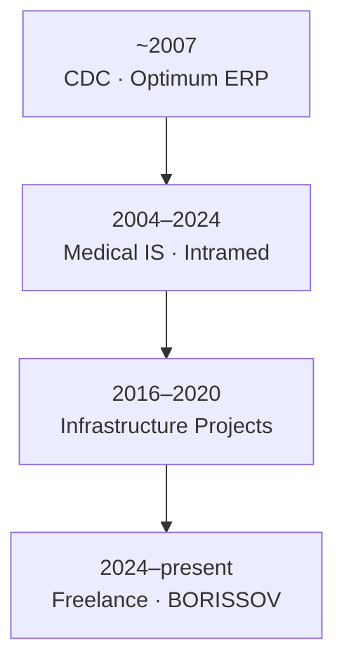

# Career Timeline

[Deutsch](../../02-career/timeline.md) · **English**

Evolution of responsibility — from enterprise software to full system ownership.

---

## ~2007 · Enterprise Software · [CDC](https://cdc.ru/)

First role: **implementation specialist for the Optimum ERP system**.

- Business requirements, configuration, rollout
- Understanding how organisations depend on integrated enterprise software
- Foundation for systems thinking that shaped the entire career

→ [Optimum project](../03-projects/01-optimum/)

---

## 2004–2024 · Medical Information Systems

Core career track: **implementation, customisation, and long-term support of Intramed** (InterSystems Caché).

- 20+ year partnership with a hospital treating **40,000 patients per year**
- Full clinical workflow — not a one-time delivery
- Integrated systems: laboratory, histopathology, document recognition
- Deployments at **additional major clinics in Russia**

→ [Medical Information System](../03-projects/02-medical-information-system/)

---

## 2016–2020 · Infrastructure & Integration Projects

| Year | Project | Focus |
|------|---------|-------|
| ~2016 | [Document Recognition](../03-projects/05-document-recognition/) | Deployment, OCR pipeline, MIS integration |
| ~2018 | [Histopathology LIS](../03-projects/04-histopathology/) | Testing, deployment, bidirectional MIS sync |
| ~2020 | [Reference Data Platform](../03-projects/03-reference-data-platform/) | WildFly cluster, air-gapped network, HA backend |

---

## 2024–Present · Freelance · [BORISSOV Engineering](https://borissov-it.de/)

| Year | Project | Role |
|------|---------|------|
| 2025 | [AI Learning Platform](../03-projects/06-ai-learning-platform/) | DevOps — K8s, GitLab CI, DevSecOps, Keycloak |
| 2025 | [BI Platform](../03-projects/07-bi-platform/) | Metabase, monitoring, backups, SSL |
| 2025 | [Investment Platform](../03-projects/08-investment-platform/) | Full ownership — development + deployment |
| 2025 | [Microservice Platform](../03-projects/09-microservice-platform/) | DevOps — CI/CD, DevSecOps *(ongoing)* |

---

## Visual Overview

