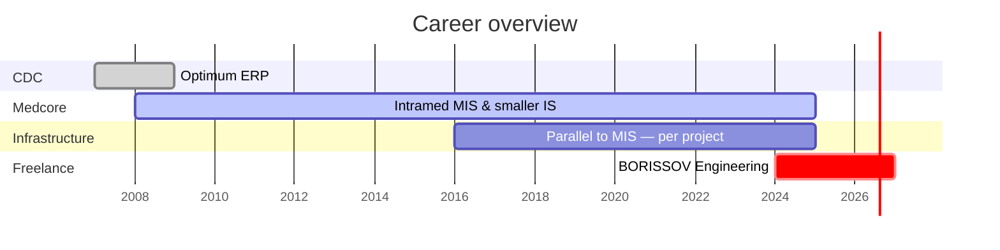

# Career Timeline

[Deutsch](../../02-career/timeline.md) · **English**

---

## 2007 – 2008 · [CDC](https://cdc.ru/) · Optimum ERP

First role: **Optimum ERP implementation**.

→ [Optimum](../03-projects/01-optimum/)

---

## 2008 – 2024 · Medcore · Medical Information Systems

**Joined Medcore in 2008:** implementation and support of **Intramed MIS** and **smaller information systems**.

- 16+ years — continuous MIS support; from ~2016 **additionally** infrastructure projects in parallel (see below)
- 40,000 patients per year
- Integrations: lab, histopathology, document recognition

→ [Medical IS](../03-projects/02-medical-information-system/)

---

## from ~2016 · Infrastructure — parallel to MIS support

**Alongside** ongoing Intramed support and other systems: **Linux, WildFly, deployment** — **per project**, not a separate full-time Linux role:

| Year | Project |
|------|---------|
| ~2016 | [Document Recognition](../03-projects/05-document-recognition/) |
| ~2018 | [Histopathology](../03-projects/04-histopathology/) |
| ~2020 | [Reference Data Platform](../03-projects/03-reference-data-platform/) |

---

## 2024 – Present · Freelance · [BORISSOV](https://borissov-it.de/)

Infrastructure and Kubernetes become explicit deliverables.

