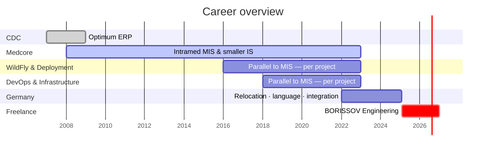

# Career Timeline

[Deutsch](../../02-career/timeline.md) · **English**

---

## 2007 – 2008 · [CDC](https://cdc.ru/) · Optimum ERP

First role: **Optimum ERP implementation**.

→ [Optimum](../03-projects/01-optimum/)

---

## 2008 – 2022 · Medcore · Medical Information Systems

**Joined Medcore in 2008:** implementation and support of **Intramed MIS** and **smaller information systems**.

- 14+ years — continuous MIS support until relocation to Germany; from ~2016 **WildFly & deployment**, from ~2018 **infrastructure, DevOps & CI/CD** in parallel (see below)
- 40,000 patients per year
- Integrations: lab, histopathology, document recognition
- Deployments at additional major clinics in Russia

→ [Medical IS](../03-projects/02-medical-information-system/)

---

## from ~2018 · DevOps, CI/CD & Linux — parallel to MIS support

From **~2018**, project-based, alongside ongoing Intramed support:

| Year | Project |
|------|---------|
| ~2018 | [Histopathology](../03-projects/04-histopathology/) |

---

## from ~2016 · WildFly & application servers — parallel to MIS support

Since **~2016**: **WildFly**, deployment, cluster operations, and application servers — **per project**:

| Year | Project |
|------|---------|
| ~2020 | [Reference Data Platform](../03-projects/03-reference-data-platform/) |
| ~2016 | [Document Recognition](../03-projects/05-document-recognition/) |

Last infrastructure projects ran in parallel with MIS support until **2022**.

---

## 2022 – 2025 · Germany · Relocation and integration

After leaving operational MIS support at Medcore: **relocation from Russia to Cologne**, **learning German**, and **professional integration** in Germany — preparation for self-employment.

- Language acquisition and adaptation to the German job market
- Preparation for freelancing (research, positioning, technical upskilling)

---

## from Feb 2025 · Freelance · [BORISSOV](https://borissov-it.de/)

Business registered **February 2025**. Infrastructure and Kubernetes become explicit deliverables.

| Year | Project |
|------|---------|
| 2025 | [AI Learning Platform](../03-projects/06-ai-learning-platform/) |
| 2025 | [BI Platform](../03-projects/07-bi-platform/) |
| 2025 | [Investment Platform](../03-projects/08-investment-platform/) |
| 2025 | [Microservice Platform](../03-projects/09-microservice-platform/) *(in progress)* |

---

## Visual overview

