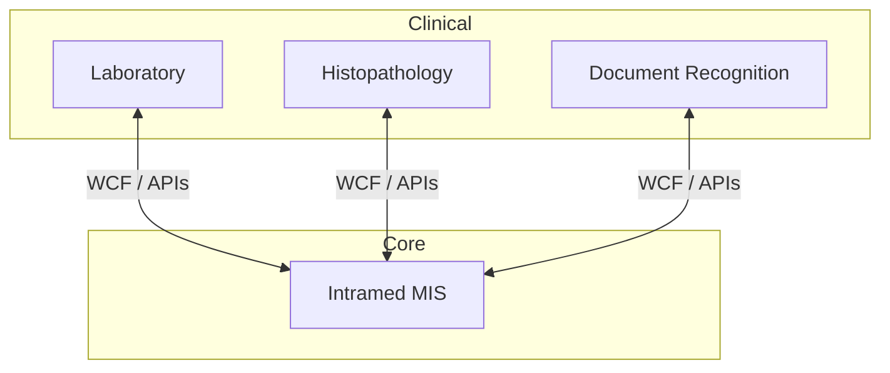

# Medical Information System (Intramed)

[Deutsch](../../../03-projects/02-medical-information-system/README.md) · **English**

## Project

From **2008 at Medcore**: implementation and long-term support of **Intramed** and **other, smaller information systems** — 40,000 patients per year.

| | |
|---|---|
| **Period** | 2008 – 2024 |
| **Employer** | Medcore |
| **Role** | Implementation, customisation, long-term support |

## Architecture

## Lessons Learned

- Long-term ownership builds depth short project cycles cannot
- Integration is often harder than the core system itself

→ [Case study on borissov-it.de](https://borissov-it.de/work)
