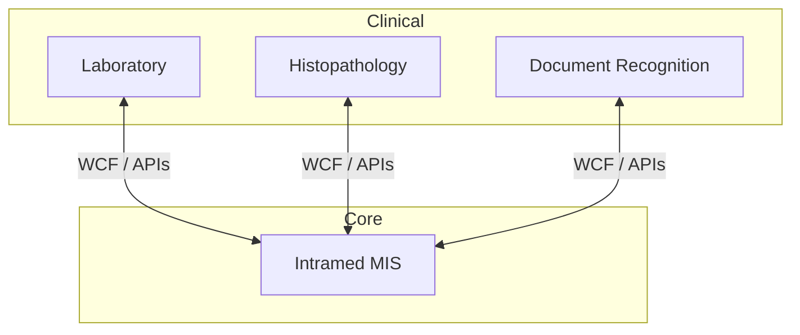

# Medical Information System (Intramed)

[Deutsch](../../../03-projects/02-medical-information-system/) · **English**

## Project

**20+ year partnership** supporting a hospital MIS on **InterSystems Caché** (Intramed) — **40,000 patients per year**. Deployments at additional major clinics in Russia. Integrated laboratory, histopathology, and document recognition.

| | |
|---|---|
| **Period** | 2004 – 2024 |
| **Role** | Implementation, customisation, long-term support |

## Architecture

## Lessons Learned

- Long-term ownership builds depth short project cycles cannot
- Integration is often harder than the core system itself

→ [Case study on borissov-it.de](https://borissov-it.de/work)
