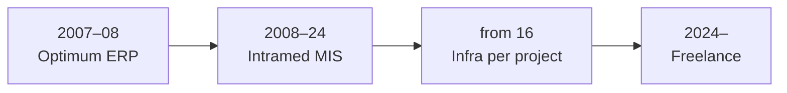

# Alex Borissov

[Deutsch](../README.md) · **English**

**Infrastructure & Automation Engineer** · Cologne, Germany

**I implement, integrate, and automate business-critical IT systems** — from enterprise software and medical information systems to modern Kubernetes platforms and self-hosted infrastructure.

I bring complex systems reliably into production — and support them from implementation through stable long-term operation. 18+ years of experience. Cologne. Independent at [borissov-it.de](https://borissov-it.de/).

This repository documents **who I am and how I work** — not an application for a specific role.

[Who I am](01-about/) · [Website](https://borissov-it.de/) · [LinkedIn](https://www.linkedin.com/in/boralekc) · [GitHub](https://github.com/boralekc) · [Summary](resume/resume.md) · [Email](mailto:alxboriss@gmail.com)

---

## Career at a Glance

| Phase | Focus |
|-------|-------|
| [CDC / Optimum](03-projects/01-optimum/) | 2007–2008 — Optimum only |
| [Medcore / Intramed](03-projects/02-medical-information-system/) | from 2008 — MIS + smaller IS |
| [Infrastructure](03-projects/) | from ~2016 — per project |
| [BORISSOV](https://borissov-it.de/) | K8s, self-hosted BI, full-stack automation |

→ Full timeline: [02-career/timeline.md](02-career/timeline.md)

---

## Featured Projects

| Project | Role | Highlight |
|---------|------|-----------|
| [Medical IS](03-projects/02-medical-information-system/) | Implementation & 20yr support | Intramed, 40k patients/year, multi-clinic |
| [BI Platform](03-projects/07-bi-platform/) | Freelance — infra + analytics | Self-hosted Metabase, Prometheus, backups |
| [AI Learning Platform](03-projects/06-ai-learning-platform/) | Freelance DevOps | 7 microservices, K8s, Keycloak, GitLab CI |
| [Investment Platform](03-projects/08-investment-platform/) | Solo — full stack | Next.js, 16 n8n workflows, Docker, CI/CD |
| [Reference Data Platform](03-projects/03-reference-data-platform/) | Infrastructure | WildFly HA, air-gapped, national transport |

[All projects →](03-projects/)

---

## Documentation Map

| Section | Contents |
|---------|----------|
| [01-about](01-about/) | Who I am — start here |
| [02-career](02-career/) | Career timeline, experience, skills |
| [03-projects](03-projects/) | Case studies with architecture diagrams |
| [04-architecture](04-architecture/) | Reusable patterns — K8s, GitOps, network |
| [05-articles](05-articles/) | Articles and LinkedIn posts |
| [06-certificates](06-certificates/) | Certifications |
| [resume](resume/) | One-page summary (not a job-targeted CV) |

---

## Core Stack

`Linux` · `Kubernetes` · `Docker` · `GitLab CI` · `GitHub Actions` · `Keycloak` · `Metabase` · `n8n` · `PostgreSQL` · `WildFly` · `Prometheus` · `Terraform` · `Next.js`

---

*This repository is structured as engineering documentation — who I am, how I work, and which systems I have brought reliably into production.*
